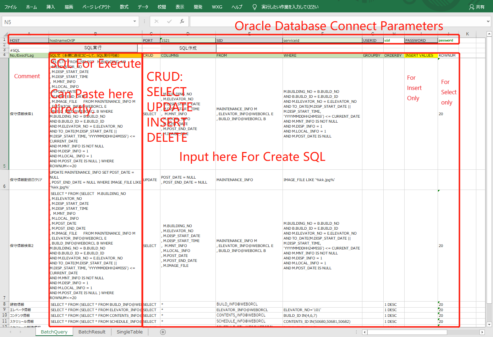

# XlsWxg
Excel Function written by C#, using by Excel Addon
SRC:<https://github.com/lqwangxg/Xlsw.git>

## Macro4OracleDB
-------------------------------
#SQL一括準備

-------------------------------
# SQL一括実行

-------------------------------
# 単テーブル操作

-------------------------------
# 単テーブル検索結果のバックアップ

#[社内ホームページにも掲載](https://mbpsmartec.co.jp/ja/excel%e3%82%88%e3%82%8aoracledb%e3%81%b8%e3%82%a2%e3%82%af%e3%82%bb%e3%82%b9%e3%81%99%e3%82%8b%e6%96%b0%e6%96%b9%e6%b3%95/)
